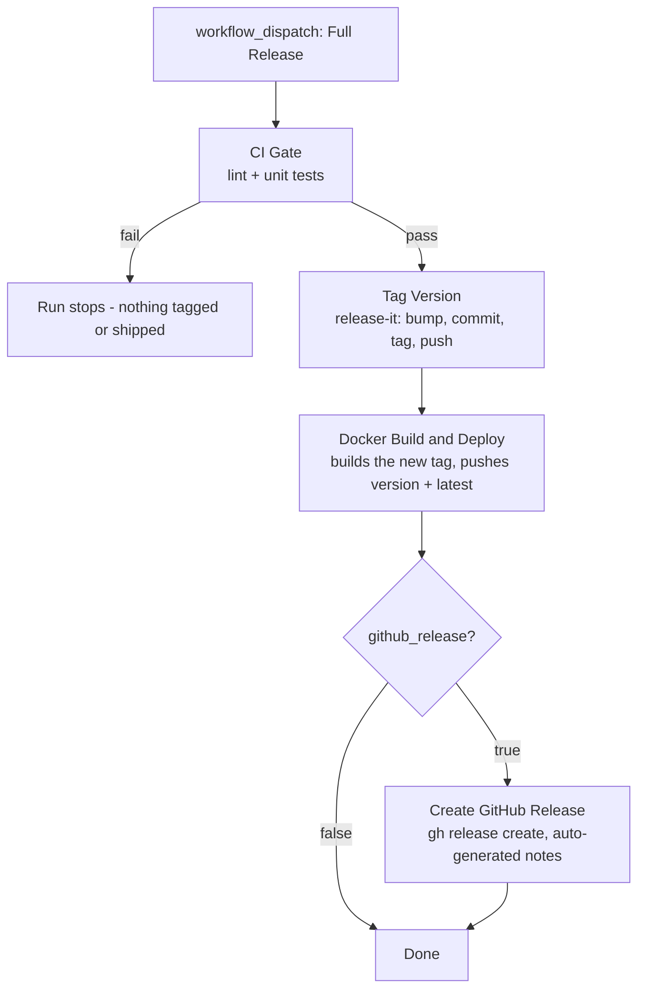

# Stream Assist Bot

## About The Project

NodeJS application that interprets commands and events on Twitch for the dedicated channel.

## Built With

* Typescript
* NodeJS/Ts-Node
* PostgreSQL
* Sequelize/Typescript-Sequelize
* Docker

## Getting Started

### Install Dependencies

Install the latest Docker CLI / Docker Desktop.

> Note: Make sure Docker is running before attempting to start the application, otherwise the application will fail to connect to the database

```
npm install
```

### Twitch Authentication

On first run, if no auth token file is present, the application will guide you through the OAuth flow via the auth server (port 8090). Complete the flow in a browser and the bot will start automatically.

To pre-seed a token instead, create `auth-tokens.{TWITCH_BROADCASTER_ID}.json` in the mapped local-cache directory before starting. See `configurations/required-scopes.ts` for the required scopes.

### Deployment

> Note: Local deployment is manual via Docker Compose. Image publishing and releases are automated - see [CI & Release Workflows](#ci--release-workflows).

**First run or after code changes - rebuild the image and start:**

```bash
docker compose up --build -d
```

**Start without rebuilding (config or volume changes only):**

```bash
docker compose up -d
```

**Stop all containers:**

```bash
docker compose down
```

**Stream logs from the running app container:**

```bash
docker compose logs -f app
```

The `-d` flag detaches immediately after starting. Omit it to follow logs in the foreground, but prefer `docker compose logs -f app` for monitoring a running deployment.

## CI & Release Workflows

All automation lives in `.github/workflows/`. Three workflows are reusable building blocks (each supports `workflow_call`), and **Full Release** orchestrates them end to end.

### CI (`ci.yml`)

The quality gate: installs dependencies, runs lint, runs unit tests.

**Triggers**:
* push to `main`
* pull requests targeting `main`
* `workflow_call` (used as the gate in Full Release)

**Inputs / secrets**: none.

**Guidelines**: this is the only merge gate - if it passes, the branch is releasable.

### Tag Version (`tag-version.yml`)

Runs [release-it](https://github.com/release-it/release-it) (configured in `.release-it.json`) to perform the version bump. release-it owns the full git lifecycle: it updates `package.json` and `.env.release`, commits, tags, and pushes.

**Triggers**:
* `workflow_dispatch` (standalone bump)
* `workflow_call` (from Full Release)

**Inputs:**
| Input | Type | Notes |
|---|---|---|
| `version_bump` | choice: `patch` / `minor` / `major` | Required. Which version fragment to bump. |
| `no_increment` | boolean | Rerun the current version without bumping. |
| `dry_run` | boolean | Dispatch only. Prints what would happen; no commit, tag, or push. |

**Outputs**: `tag` - the version that was tagged (bare version, no `v` prefix), consumed by callers.

**Guidelines**:
* Use `dry_run` to validate release-it behavior after changing `.release-it.json` - dry-run always wins over config, so no git action executes.
* An **un-released bump** (run this standalone, release later via Full Release with `no_increment`) is a supported pattern.

### Docker Build and Deploy (`docker-build.yml`)

Builds the production image and pushes it to Docker Hub as `itanex/stream-assist-bot:<version>` and `:latest`. The version tag comes from `IMAGE_TAG` in `.env.release` *at the built ref*.

**Triggers**:
* `workflow_dispatch` (standalone build)
* `workflow_call` (from Full Release)

**Inputs:**
| Input | Type | Notes |
|---|---|---|
| `dry_run` | boolean | Build but skip the push. |
| `ref` | string | Git ref (tag, branch, SHA) to build. Empty = the triggering ref. Full Release passes the freshly created tag here. |

**Secrets**:
* `DOCKER_HUB_USERNAME`,
* `DOCKER_HUB_TOKEN`

**Guidelines**: To rebuild a published version against a patched base docker image without touching the repo, dispatch this workflow directly with `ref` set to that version tag.

### Full Release (`release.yml`)

The single-invocation release pipeline. Manual `workflow_dispatch` only.

**Inputs:**
| Input | Type | Notes |
|---|---|---|
| `version_bump` | choice: `patch` / `minor` / `major` | Required. Passed to Tag Version. |
| `no_increment` | boolean | Re-release the current version (see below). |
| `github_release` | boolean, default `true` | Create a GitHub Release for the tag after the image ships. |



**Guidelines**:
* Each stage gates the next via `needs:` - a lint/test failure stops the run before anything is tagged.
* The Docker stage builds the tag created in the same run (not the SHA the run started from), so the image always matches the tagged commit.
* A tag can have at most **one** GitHub Release; `github_release` fails if one already exists for the version.

#### Re-releasing a version (`no_increment`)

To rebuild and re-push an existing version (e.g. a base-image CVE fix with no repo changes): set `no_increment: true` and **uncheck `github_release`** (the release for that tag already exists).

Two boundaries to respect:

* The tag does not move. The rebuild uses the tag's original commit, so it only picks up changes *outside* the repo (like a patched base docker image). If the fix touched any file in the repo, bump at least `patch` instead.
* If only the docker image needs rebuilding, dispatching **Docker Build and Deploy** directly with `ref` set to the version tag is the preferred approach.

## Usage

This application is distributed under the GPLv3 license and is expected to be executed under the same principles.

This application is designed as a chat-bot and stream management application, specifically for twitch. The use of this bot on other streaming services is not supported and the use of this bot, unless otherwised arranged, is at the users own risk.

## Contributing

Any contributions you make are greatly appreciated.

If you have a suggestion that would make this better, please fork the repo and create a pull request. You can also simply open an issue with the tag "enhancement". Don't forget to give the project a star! Thanks again!

1. Fork the Project
2. Create your Feature Branch (git checkout -b feature/AmazingFeature)
3. Commit your Changes (git commit -m 'Add some AmazingFeature')
4. Push to the Branch (git push origin feature/AmazingFeature)
5. Open a Pull Request

## License

Distributed currently under GPLv3. For more infomation see the `License` file in the repository.

## Links

* [Project Link](https://github.com/users/itanex/projects/2/)
* [TwurpleJS](https://twurple.js.org/)
* [Sequelize](https://sequelize.org/)
* [Docker](https://www.docker.com/)

## Developed Live On Twitch Stream

[TimyTheTermite](https://twitch.tv/timythetermite)

Contact [TimyTheTermite](https://bsky.app/profile/timythetermite.bsky.social) on [Blue Sky](https://bsky.app/)
